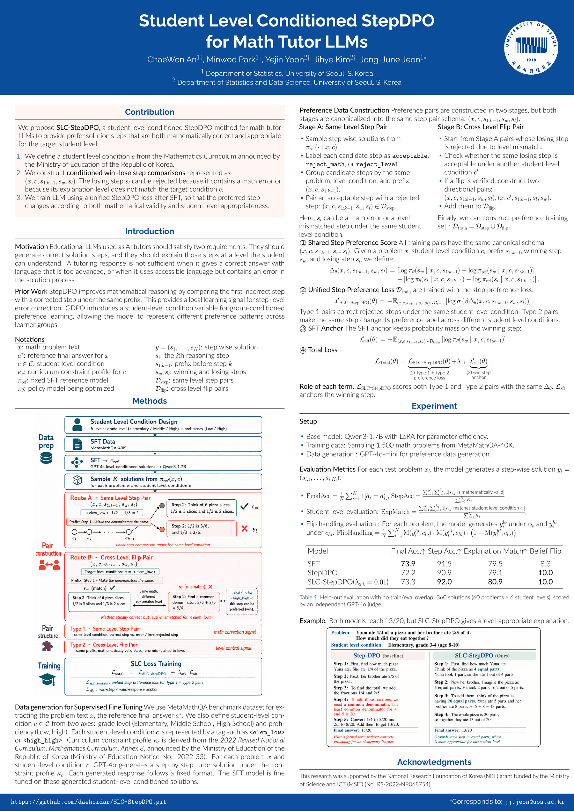

# SLC-StepDPO

**Student Level Conditioned StepDPO for Math Tutor LLMs**
2026 한국인공지능학회 하계학술대회 포스터 발표 (2026.08, 경주)

수학 튜터 LLM이 수학적으로 정확하면서 동시에 학생 수준에 맞는 풀이 단계를 생성하도록 학습하는 선호학습 방법이다. Base 모델은 Qwen3-1.7B(LoRA)이고, 학생 수준은 2022 개정 수학과 교육과정을 따른다.

## Poster

[](docs/poster/SLC-StepDPO_poster_KAIA2026.pdf)

> 이미지를 클릭하면 [원본 PDF](docs/poster/SLC-StepDPO_poster_KAIA2026.pdf)로 이동한다.

## Method

AI 수학 튜터는 두 요건을 동시에 만족해야 한다. 각 추론 step이 수학적으로 타당해야 하고(정확성), 학생이 배운 범위의 어휘와 개념으로 설명해야 한다(수준 적합성). 정답이지만 너무 어렵거나, 쉽지만 틀린 풀이는 충분하지 않다.

SLC-StepDPO는 StepDPO를 학생 수준 변수 `c`로 조건화해 이 둘을 하나의 손실로 최적화한다. `c`는 학년(초·중·고) × 성취(상·하)의 6수준이며(예: `<elem_low>`, `<high_high>`), 각 수준은 교육과정 제약 프로파일 `κ_c`에 대응한다. 수준별 화법·금지 어휘·선호 어휘와 교육과정 근거는 `personas.json`에 정의되어 있고, 각 어휘는 2022 개정 교육과정의 학년별 도입 시점과 대조해 검증했다.

모든 선호쌍은 하나의 스키마 `(x, c, s_{1:k-1}, s_w, s_l)`와 하나의 손실을 공유한다.

```
L_Total = L_SLC-StepDPO + λ_sft · L_sft

L_SLC-StepDPO = - E[ log σ( β Δθ ) ]
Δθ = [log πθ(s_w | x,c,prefix) - log π_ref(s_w | x,c,prefix)]
   - [log πθ(s_l | x,c,prefix) - log π_ref(s_l | x,c,prefix)]
L_sft = - E[ log πθ(s_w | x,c,prefix) ]
```

선호 데이터는 두 종류의 쌍으로 구성한다.

- **Type-1 (same-level)**: 동일 수준 `c` 안에서, acceptable step과 수학 오류(`reject_math`) 또는 수준 불일치(`reject_level`)로 reject된 step의 쌍.
- **Type-2 (cross-level flip)**: 동일한 step이 두 수준 `c`, `c'`에서 win과 lose로 뒤집히는 쌍. 수준 제어 신호를 명시적으로 학습한다.

자세한 수식과 데이터 구성 절차는 위 포스터에 정리되어 있다.

## Pipeline

1. **SFT** — GPT-4o가 `κ_c` 아래 생성한 수준 조건 풀이로 미세조정 → `π_ref`
2. **Sampling & Labeling** — `π_ref`에서 step 샘플링 후 `acceptable` / `reject_math` / `reject_level` 라벨링
3. **Pair 구성** — Type-1, Type-2 쌍 → `D_train = D_step ∪ D_flip`
4. **SLC-StepDPO 학습**
5. **평가**

학습 데이터는 MetaMathQA-40K에서 1,500문제를 샘플링했고, 선호 데이터 생성에는 GPT-4o-mini를 사용했다. 실행 가이드는 [PIPELINE.md](PIPELINE.md), 파일별 역할은 [CODEMAP.md](CODEMAP.md)를 참조한다.

## Results

Held-out 평가. 학습/평가 데이터 중복 없음. 360개 풀이(60문제 × 6수준)를 GPT-4o judge로 채점했다.

| Model | Final Acc. | Step Acc. | Explanation Match | Belief-Flip |
|---|:---:|:---:|:---:|:---:|
| SFT (baseline) | 73.9 | 91.5 | 79.5 | 8.3 |
| StepDPO | 72.2 | 90.9 | 79.1 | 10.0 |
| SLC-StepDPO (λ_sft = 0) | 72.8 | 91.6 | **81.7** | 10.0 |
| SLC-StepDPO (λ_sft = 0.01) | 73.3 | **92.0** | 80.9 | 10.0 |
| SLC-StepDPO (λ_sft = 0.03) | **76.1** | 91.4 | 78.6 | **15.0** |

포스터에는 λ_sft = 0.01 설정을 보고했다.

SLC-StepDPO는 비교 대상인 SFT·StepDPO 대비 Step Acc와 Explanation Match에서 우위를 보인다. 다만 **지표별 최고값이 서로 다른 λ_sft에서 나오며, 네 지표를 동시에 최적화하는 단일 설정은 없다.** λ_sft는 정답 정확도(Final Acc)와 수준 적합성(Explanation Match) 사이의 트레이드오프를 결정한다.

Belief-Flip은 60문제 기준 비율이므로 8.3 / 10.0 / 15.0은 각각 5 / 6 / 9문제에 해당한다. 표본이 작아 해석에 주의가 필요하다.

결과 표 그림은 `docs/figures_final/fig_table_lambda.png`, 수준별 풀이 차이의 정성 예시는 `fig_qual_frac.png`(초등, 분수 비유)와 `fig_qual_high.png`(고등, 공식)에 있다.

### Evaluation metrics

| 지표 | 정의 |
|---|---|
| Final Acc. | 최종 정답 일치 비율 |
| Step Acc. | 수학적으로 타당한 step 비율 (전체 step 누적) |
| Explanation Match | 대상 수준의 어휘와 개념을 지킨 step 비율 |
| Belief-Flip | 저수준·고수준 풀이가 각자 수준에 맞으면서 서로 구별되는 비율 |

## 실행

```bash
pip install -r requirements.txt
# 학습 및 평가 상세 절차는 PIPELINE.md 참조
```

핵심 코드는 `data_pipeline_stepdpo/4_train_bc_stepdpo.py`(SLC-StepDPO 학습, `--lambda-sft`로 조절), `data_pipeline/5_evaluate.py`(평가), `scripts/run_lambda_sweep_slurm.sh`(λ_sft sweep)이다.

## Citation

```
ChaeWon An, Minwoo Park, Yejin Yoon, Jihye Kim, Jong-June Jeon.
"Student Level Conditioned StepDPO for Math Tutor LLMs."
2026 한국인공지능학회 하계학술대회, 경주, 2026. 8. (포스터 발표)
```

## Acknowledgments

This research was supported by the National Research Foundation of Korea (NRF) grant funded by the Ministry of Science and ICT (MSIT) (No. RS-2022-NR068754).
